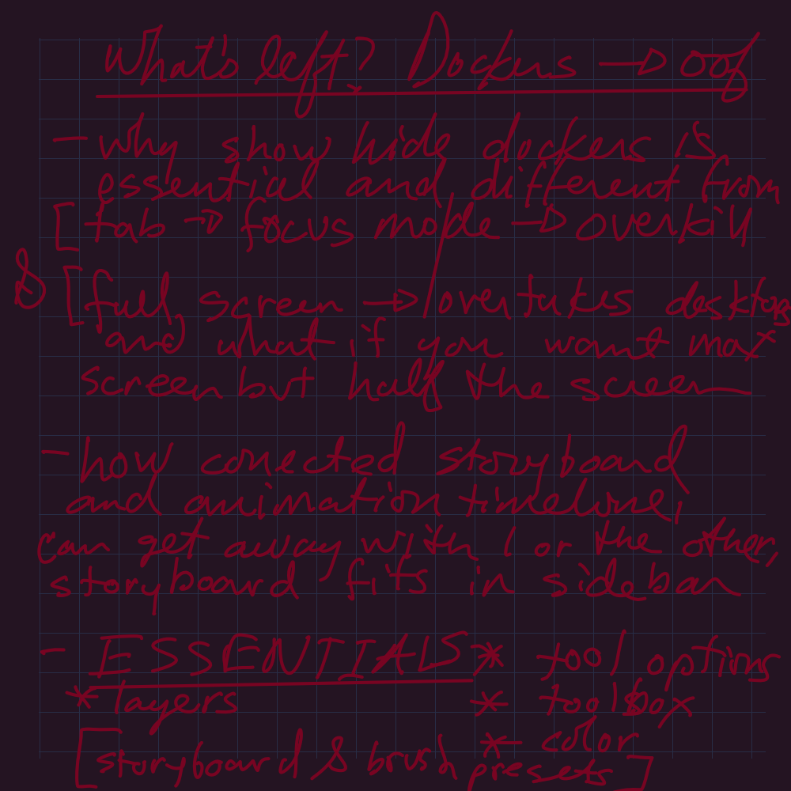

Krita for Notes
===============

### Default Krita Layout to My Notes Layout

- set up brush favorites
- set up brush defaults (sizes, opacity, name prefix)
- custom name prefixes to put eraser between pen and pencil
- essential dockers
- adding custom pattern (100x100)
- prefer frames to large canvas (1000x1000)
- using pattern background with storyboard

### Brush Editor Defaults

| Brush     | Width px | Opacity % |
| --------- |---------:|----------:|
| pencil 2  |        5 |        90 |
| eraser sm |       35 |     50-75 |
| basic 1   |        3 |       100 |
| marker dry|       40 |        50 |
| pixel art |        1 |       100 |

- defaults are important because each time you run krita brushes are reset to default
- the pencil is the best tool for writing because it shows your pressure serifs
  without clobbering main strokes, making it look natural
- basic 1 is the most normal pen
- do not get lost in sea of brushes, stick with pencil and basic
- marker dry is a highlighter that works well with the line tool
 
### Quick-key Essentials

| Key          |         Action |
| -------------|----------------|
| space + drag |    pan         |
| 1            | **scale 100**  |
| 2            | zoom fit       |
| 4            | tilt -15°      |
| 5            | center to 0°   |
| 6            | **tilt 15°**   |
| R            | rectangle      |
| b            | brush          |
| [ ]          | brush size     |
| k l          | darker lighter |
| i o          | opacity        |
| e            | erase          |
| ,            | previous brush |
| .            | next brush     |
| /            | last brush     |
| p            | color picker   | 
| ctrl e       | merge down     |

> work at scale 100, prefer frames to super large canvas

> prefer space bar to pan

### Custom Key-bindings

| Key | Action    |
| ----|-----------|
| q   | line tool |
| z   | undo      |
| Z   | redo      |
| d   | show/hide dockers |

- keybindings should be a single key instead of 2 (ctrl z v z), this is the mypaint philosophy and is better
- you should only create key bindings for common actions (minimum startup/sharing friction)
  

### Useful Quick-key Sequences

| Sequence | Actions                    |
| ---------|----------------------------|
| b q R    | brush, line, rectangle     |
| b , . /  | brush next prev last brush |
| 2 1 5    | center zoom rotate 0       |
| 2 1 5 4  | center zoom tilt -15       |

### Paste Into Active Layer 

- the default paste (ctrl-v) creates a layer, however
  keyframes / storyboard frames are on a single layer, so
  if you want to paste into a storyboard frame you can either:
    - paste and merge down (ctrl e) or
    - **Paste into Active Layer** from edit menu
- after Paste into Active Layer the transform tool is automatically selected so you can move the pasted rectangle

### Eraser Brush vs Erase Mode

- if you ever find that line, fill, or draw tools are not working you might be in eraser mode, which works in
  conjuntion with the other tools

- eraser mode not the same as eraser brush, pressing e does not change the
  current brush, but rather uses the current brushes shape as an eraser
  
- whereas the eraser brush will have its own shape

- rename prefix of pencil, eraser, pen to abc so that eraser is between pen and
  pencil: this makes using / after , or . toggle between eraser and pen or pencil

- erase mode affects not just brush but fill and line as well, the pattern fill
  will take away rather than paint on top

- eraser mode not the same as ctrl-i, which will invert a result, but you can
  combine invert and eraser to use dark patterns on dark layers and light patterns
  on light layers

- brush palatte set to My Favorites and only have brushes that are commonly used
  so brush cycle with , . is limited and brush palatte docker isnt too full

### Storyboard Notes

- Scene, vs Frame, vs Page
  - a scene is a keyframe where the background is possibly new
  - a frame is a layer in the animation timeline, possibly between scenes or it may be a scene,
  - a frame can be exported to png, representing 1 frame from the animation timeline
  - all frames can be exported to a png sequence using File -> Render Animation
  - Pages are annalogous to Storyboard Scene
  
- The storyboard is a simplified view of the Animation Timeline Docker.

- Each Storyboard scene is a keyframe in the animation timeline

- When you have the Animation Docker open you can:
    - set time per frame (speed)
    - navigate between frames with arrow left right
    - create a duplicate or new frame between scenes
    - create a new scene (keyframe)
    - make a mess or fix storyboard issues
 
- Recommend using Storyboard only or Anim Timeline minimally for notes

- the last frame number is n-1, used for Render and Anim Timeline Loop End
  
- select destination folder and frame basename (the start of the filename)
  that the frame number will be appended too

- it is helpful to keep layers simple when using storyboard, have one background
  layer, have it locked, and a layer above the background, which will be your
  animation layer (storyboard)

### Why Show Hide Docker

- Show Hide Docker is better than Show Canvas Only (tab key) and Full Screen Mode
  (f11 key), this is why I create a keybinding for it (d)

- the reason is simple: Show Hide Dockers maximizes the canvas without affecting the window size, this
  means maximum drawing area despite not using the entire screen, leaving you to use rest for another app

### Essential Dockers

1. Storyboard
    - create scene / page with plus sign
    - changing slide duration from 0s will insert non keyframe frames between each scene (avoid)
1. Brush Presets
    - used to determine what is in your quick access, select My Favorites to limit brush palatte
1. Layers
    - check everytime you add a scene or paste so that you merge into animation frame ie. layers outside
      animation layer will appear above all the scenes
1. Tool Options
    - essential for certain tools, like crop to perform the crop and fill to select pattern / outline etc
1. Toolbox
    - change icon size by right click in docker
1. Palette
    - has bug must reselect palatte sometimes
1. Advanced Color Selector
    - color history on right strip

### Other Useful Dockers

1. Undo History
2. Animation Timeline

### Finally, making notes

1. Load line / graph pattern kra
2. Set Fill Pattern to custom (the file pattern we just opened)
3. Create background 
- A single layer
- Is possibly reused when new scene created
- Should lock this layer
4. Create Pages (Storyboard Scenes)
- If background doesnt copy, you can grab entire layer and paste it into background, then make
  another Page to get it to stick
  
### Brainstorm Frames

- these following brainstorm notes were reviewed to make this page, using render animation
  to create each page / frame / scene

[storyboard as pages][1]

[1]: ./media/05-11-2024.kra
